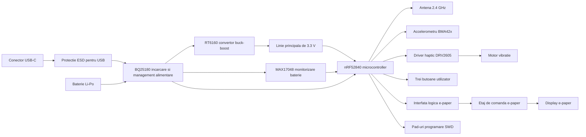

# InkTime

## Prezentarea proiectului

InkTime este un smartwatch open-source, cu cost redus, construit in jurul platformei nRF52840. Proiectul urmeaza cerinta din cadrul cursului de a duce produsul de la stadiul de proiectare electronica pana la o versiune care poate fi fabricata, asamblata si verificata mecanic in carcasa oferita. Repository-ul curent contine schema electrica, layout-ul PCB-ului, fisierele de fabricatie si integrarea 3D necesara pentru etapa EVT.

Designul combina comunicatie wireless, incarcare pentru baterie, monitorizarea bateriei, detectarea miscarii, feedback haptic si interfata pentru un display e-paper pe o placa compacta, adaptata formei carcasei ceasului. Placa a fost dezvoltata ca o solutie pe doua straturi, cu componentele principale plasate pe stratul superior, iar integrarea mecanica a fost verificata in Fusion folosind modelul de carcasa pus la dispozitie.

## Diagrama bloc

## Bill of Materials

Tabelul de mai jos reprezinta un BOM scurt inclus in README. Fisierele complete pentru fabricatie si asamblare se gasesc in folderul `Manufacturing`. Pentru claritate, tabelul pune accent pe componentele principale si nu pe toate componentele pasive de pe placa.

| Designator | Componenta | Rol in proiect | Link JLC / achizitie | Datasheet |
|---|---|---|---|---|
| U1 | nRF52840-QIAA-R | Microcontroller principal si platforma wireless | [JLCPCB](https://jlcpcb.com/partdetail/NordicSemicon-NRF52840_QIAAR/C190794) | [Nordic Product Specification](https://docs.nordicsemi.com/bundle/nRF52840_PS_v1.9/resource/nRF52840_PS_v1.9.pdf) |
| IC1 | BQ25180YBGR | Incarcator pentru baterie Li-Po si management de alimentare | [JLCPCB](https://jlcpcb.com/partdetail/C3682423) | [Texas Instruments](https://www.ti.com/lit/gpn/BQ25180) |
| IC9 | RT6160AWSC | Convertor buck-boost pentru generarea liniei principale de 3.3 V | [JLCPCB](https://jlcpcb.com/partdetail/C7065276) | [Richtek](https://www.richtek.com/assets/product_file/RT6160A/DS6160A-05.pdf) |
| U3 | MAX17048G+T10 | Circuit de monitorizare a nivelului bateriei | [JLCPCB](https://jlcpcb.com/partdetail/MaximIntegrated-MAX17048GT10/C2682616) | [Analog Devices](https://www.analog.com/media/en/technical-documentation/data-sheets/max17048-max17049.pdf) |
| IC3 | Bosch BMA42x | Accelerometru pentru detectarea miscarii | [JLCPCB search for BMA42x family](https://jlcpcb.com/partdetail/C5242966) | [BMA423 datasheet](https://watchy.sqfmi.com/assets/files/BST-BMA423-DS000-1509600-950150f51058597a6234dd3eaafbb1f0.pdf) |
| IC2 | DRV2605YZFR | Driver haptic pentru actuatorul de vibratie | [JLCPCB](https://jlcpcb.com/partdetail/TexasInstruments-DRV2605YZFR/C81079) | [Texas Instruments](https://www.ti.com/lit/ds/symlink/drv2605.pdf) |
| ANT1 | 2450AT18B100E | Antena chip de 2.4 GHz pentru sectiunea RF | [JLCPCB](https://jlcpcb.com/partdetail/JohansonTechnology-2450AT18B100/C2836414) | [Johanson Technology](https://www.johansontechnology.com/docs/1187/2450AT18B100_X8XXogU.pdf) |
| J4 | KH-TYPE-C-16P | Conector USB-C pentru incarcare si date USB | [JLCPCB](https://jlcpcb.com/partdetail/KH-TYPE-C-16P/C709357) | [Part page with downloadable datasheet](https://jlcpcb.com/partdetail/KH-TYPE-C-16P/C709357) |
| D3 | USBLC6-2SC6Y | Protectie ESD pentru liniile USB | [Reference part page](https://jlcpcb.com/partdetail/ElecSuper-SP2555NUTG_ES/C54533292) | [STMicroelectronics](https://www.st.com/resource/en/datasheet/usblc6-2sc6y.pdf) |
| J1 | 503480-2400 | Conector cu pas fin pentru display-ul e-paper | [Selected connector family](https://www.molex.com/en-us/products/part-detail/5034802400) | [Molex product page](https://www.molex.com/en-us/products/part-detail/5034802400) |
| J2 | TC2030-IDC | Conector extern pentru programare si depanare | [Tag-Connect](https://www.tag-connect.com/product/tc2030-idc-nl) | [Product page](https://www.tag-connect.com/product/tc2030-idc-nl) |

Bateria, panoul e-paper si actuatorul haptic fac de asemenea parte din produsul final, insa in repository-ul curent ele sunt tratate in principal ca elemente de integrare mecanica. Modelele lor 3D sunt incluse in lucrul de asamblare pentru a verifica dispozitivul complet in interiorul carcasei.

## Functionalitatea hardware

Nucleul sistemului este nRF52840, ales pentru ca se potriveste unui dispozitiv purtabil care are nevoie de consum redus, suport wireless integrat si suficiente interfete digitale pentru senzori, controlul display-ului si depanare. In jurul microcontroller-ului, designul pastreaza reteaua RF si antena aproape de marginea placii, iar condensatoarele de decuplare sunt amplasate aproape de pinii de alimentare pentru a mentine sursa stabila.

Sectiunea de alimentare porneste de la conectorul USB-C. Liniile USB sunt protejate de un circuit dedicat de protectie ESD inainte sa ajunga in restul circuitului. Incarcatorul BQ25180 gestioneaza alimentarea de intrare, incarca bateria cu o singura celula si ofera calea de alimentare necesara atunci cand este prezenta tensiunea de la USB. Starea bateriei este monitorizata de MAX17048, astfel incat firmware-ul sa poata estima nivelul de incarcare si sa afiseze aceasta informatie utilizatorului.

Pentru ca sistemul trebuie sa ramana stabil atat atunci cand functioneaza din USB, cat si atunci cand functioneaza din baterie, linia principala este generata de convertorul RT6160. Acest bloc creeaza tensiunea de 3.3 V folosita de partea logica a ceasului. Rezultatul este o alimentare mai stabila pentru microcontroller, senzor, driverul haptic si interfata display-ului.

Detectarea miscarii este realizata cu un accelerometru din familia Bosch BMA42x. Acest dispozitiv comunica cu microcontroller-ul prin magistrala seriala comuna si ofera si linii de intrerupere, ceea ce permite trezirea sistemului sau detectarea unor evenimente de miscare fara interogare continua.

Feedback-ul pentru utilizator este oferit in doua moduri. Primul este vizual, prin conectorul pentru display-ul e-paper si etajul dedicat de comanda al acestuia. Al doilea este tactil, prin driverul DRV2605, care controleaza actuatorul de vibratie. Driverul haptic este conectat pe aceeasi magistrala seriala folosita de celelalte periferice lente, iar un semnal separat de activare permite control clar din partea microcontroller-ului.

Zona dedicata e-paper include atat interfata logica, cat si etajul mic de comanda necesar panoului. Semnalele logice sunt generate de microcontroller, in timp ce etajul analogic extern creeaza tensiunile auxiliare cerute de display. Pe langa conectorul propriu-zis, placa include si un element de comutatie care permite activarea sau dezactivarea ramurii de alimentare a display-ului atunci cand este necesar pentru economisirea energiei.

Trei butoane de utilizator sunt plasate pe placa si aliniate cu butoanele laterale ale carcasei. Fiecare buton este conectat la o intrare dedicata si are o retea pasiva simpla pentru citire stabila. Programarea si depanarea sunt disponibile prin interfata SWD si prin test pad-uri marcate clar, ceea ce usureaza aducerea placii in functiune si validarea.

## Utilizarea pinilor nRF52840

Tabelul de mai jos rezuma principalele conexiuni vizibile in schema incarcata. Scopul acestei sectiuni este sa arate modul in care resursele microcontroller-ului au fost grupate astfel incat designul sa ramana simplu de rutat si usor de urmarit in review.

| Semnal MCU | Functia conectata | Motivul utilizarii |
|---|---|---|
| P0.06 | SDA pentru charger, accelerometru, fuel gauge si driver haptic | O magistrala comuna pentru control reduce complexitatea rutarii si lasa mai multi pini disponibili pentru display si butoane. |
| P0.07 | SCL pentru charger, accelerometru, fuel gauge si driver haptic | Acest pin completeaza magistrala comuna folosita de perifericele de control. |
| P0.08 | IMU interrupt 1 | Aceasta linie permite senzorului sa anunte microcontroller-ul atunci cand apare un eveniment legat de miscare. |
| P1.08 | IMU interrupt 2 | A doua linie de intrerupere ofera flexibilitate pentru functii viitoare si pentru trezire in mod de consum redus. |
| P0.10 | Alerta fuel gauge | Acest semnal poate informa firmware-ul despre evenimente legate de baterie fara interogare constanta. |
| P0.11 | Intrerupere charger | Starea incarcatorului poate fi observata direct de microcontroller, ceea ce ajuta la incarcare si la schimbarile de regim de alimentare. |
| P0.12 | Activare haptic | O linie dedicata ofera control direct asupra sectiunii haptice. |
| P0.02 | Clock serial pentru e-paper | Acest pin este folosit ca linie de ceas pentru interfata de date a display-ului. |
| P0.03 | Date seriale pentru e-paper | Acest pin transporta fluxul de date catre display. |
| P0.05 | Chip select pentru e-paper | Interfata display-ului este separata printr-un semnal dedicat de selectare. |
| P0.15 | Selectare date/comanda pentru e-paper | Aceasta linie diferentiaza comenzile de datele trimise display-ului. |
| P0.16 | Reset pentru e-paper | Display-ul poate fi reinitializat corect prin firmware. |
| P0.17 | Busy pentru e-paper | Microcontroller-ul poate astepta finalizarea operatiilor interne ale panoului inainte de o noua comanda. |
| P1.01 | Control comutare alimentare display | Acest pin comanda poarta MOSFET-ului care activeaza sau dezactiveaza alimentarea display-ului. |
| P0.13 | Intrare buton utilizator | Intrare digitala dedicata pentru unul dintre butoanele ceasului. |
| P0.14 | Intrare buton utilizator | Intrare digitala dedicata pentru unul dintre butoanele ceasului. |
| P1.02 | Intrare buton utilizator | Intrare digitala dedicata pentru al treilea buton al ceasului. |
| D+ / D- / VBUS | Interfata USB nativa | Aceste linii ofera conexiunea USB folosita pentru incarcare si posibila comunicatie pe fir. |
| SWDIO / SWDCLK / P1.00 | Programare si depanare | Aceste semnale permit incarcarea firmware-ului, depanarea si validarea prin SWD si test pad-uri. |

In acest design, liniile display-ului au fost pastrate separat de magistrala comuna de control, astfel incat calea de actualizare a imaginii sa ramana clara si directa. Magistrala comuna a fost rezervata pentru functiile suport, cum sunt incarcarea, monitorizarea bateriei, detectarea miscarii si controlul haptic, ceea ce reprezinta o impartire practica pentru o placa compacta de tip wearable.

## Integrarea PCB-ului si a partii mecanice

Forma PCB-ului urmeaza geometria carcasei si pastreaza antena spre marginea exterioara a placii. Cele trei butoane de utilizator sunt aliniate cu butoanele mecanice din carcasa, iar conectorul USB-C este pozitionat pe marginea placii pentru a ramane accesibil din exterior. Fisierele 3D din repository arata ca placa electronica a fost verificata impreuna cu carcasa pentru confirmarea potrivirii mecanice.

Capturile prezente in proiect pot fi introduse direct in README daca este nevoie. O imagine cu placa in 3D poate fi afisata cu ``, iar o vedere cu placa montata in carcasa poate fi afisata cu ``.

## Decizii de proiectare si observatii pentru review

Acest proiect a fost organizat astfel incat blocurile principale sa ramana usor de verificat in cadrul review-ului. Circuitul de alimentare a fost grupat compact, perifericele de control au fost plasate logic, iar zona RF a fost izolata aproape de marginea cu antena. Au fost adaugate test pad-uri pentru semnalele importante de alimentare si depanare, lucru util atat la aducerea in functiune, cat si in etapa de review.

O decizie practica in acest design a fost impartirea repository-ului in folderele `Hardware`, `Manufacturing`, `Mechanical` si `Images`, deoarece aceasta organizare urmeaza formatul cerut la curs si face proiectul mai usor de inspectat. O alta alegere importanta a fost pregatirea placii nu doar pentru verificare electrica, ci si pentru integrare in carcasa, deoarece validarea finala depinde atat de partea electrica, cat si de cea mecanica.

## Continutul repository-ului

Repository-ul este organizat conform cerintelor cursului. Folderul `Hardware` contine fisierele native pentru schema si PCB, impreuna cu exporturile PDF ale schemei. Folderul `Manufacturing` contine fisierele generate pentru fabricatie si asamblare. Folderul `Mechanical` contine lucrul de integrare in Fusion pentru ansamblul mecanic, iar folderul `Images` contine capturi care documenteaza layout-ul si integrarea in carcasa.

## Concluzie

InkTime este o platforma hardware compacta pentru un smartwatch, construita in jurul unui microcontroller cu consum redus, a unei arhitecturi de alimentare centrate pe baterie si a unui set complet de periferice potrivite pentru utilizare wearable. Versiunea actuala a proiectului include deja fisierele de design, iesirile pentru fabricatie si verificarile mecanice necesare pentru a continua spre validare, review si prezentarea finala.
